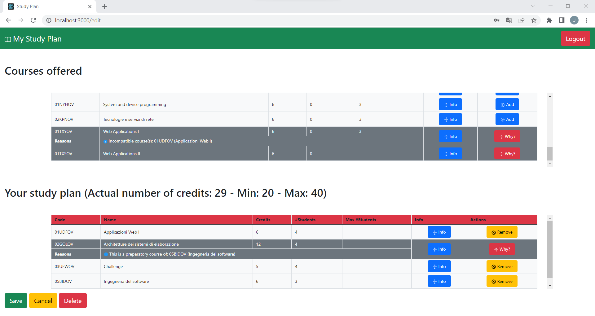

# Exam #1: "Study Plan"
## Student: s302298 DE CRISTOFARO JACOPO 

## React Client Application Routes

Unauthenticated user Routes
- Route `\`: Homepage of the website, containing the list of the courses offered.
- Route `\login`: Page that contain the login form. If the login procedure is successfull the user will be redirect to the logged-in homepage.
- Route `*`: Will redirect to Route  `\` (unauthenticated user route).

Authenticated user Routes
- Route `\`: Homepage of the logged-in user, containing the list of the courses offered and his actual study plan if any, otherwise it will be displayed a form to create it.
- Route `\edit`: This page allows the user to modify or delete his study plan.
- Route `*`: Will redirect to Route  `\` (authenticated user route).


## API Server

- POST `/api/sessions`
  - API used to authenticate the user. Returns his non-sensitive data if the credentials are valid.
  - Body content: a JSON object containing the user email and the password.
  - Response: 200 OK (success). Body: a JSON object that describe the user and also a cookie that binds the user to the session.
    ```
    {
      "name":"Antonio",
      "full":1
    }
    ```
  - Bad responses: 400 Bad Request (email not valid or password field absent or empty),401 Not Authorized (Incorrect username or password), 500 Internal Server Error (generic error).

- GET `/api/sessions/current`
  - API uses to check if the user has a valid session. Returns his non-sensitive data if a valid session exists.
  - Body content: empty. In the header must be send the cookie assigned by the server at login time.
  - Response: 201 Created (success). Body: a JSON object that describe the user.
    ```
    {
      "name":"Antonio",
      "full":1
    }
    ```
  - Bad response: 401 Not Authorized (Not Authenticated).

- DELETE `/api/sessions/current`
  - API used to delete the session of an authenticated user.
  - Body content: empty. In the header must be send the cookie assigned  by the server at login time, that specify the session to delete.
  - Reponse: 200 OK. Body: empty.
  - Bad response: 401 Not Authorized (Not authenticated).


- GET `/api/courses`
  - API used to retrieve all the courses offered.
  - Body content: empty.
  - Response: 200 OK. Body: a JSON object that contains Course object.

    ```
    {
      "courses": *list of Course objects*,
    }
    ```
  - Bad response: 500 Internal Server Error.

- GET `/api/studyplan`
  - API used to retrieve, if exists, the studyplan of an authenticated user.
  - Body content: empty. In the header must be send the cookie assigned by the server at login time.
  - Response: 200 OK. Body: a JSON object that describe the study plan.
    ```
     {
      "courses": *list of Course objects*,
      "act_cfu":71,
      "max":80,
      "min":60
     }
    ```
  - Bad response: 401 Not Authorized (Cookie absent or not valid), 404 Not Found (The student does not have a study plan yet), 500 Internal Server Error (generic error).

- PUT `/api/studyplan`
  - API used to update the study plan of the authenticated user or to create a new one if it does not exist. The validity of the study plan will be checked.
  - Body content: a JSON object that is composed by the list of courses, `courses`, (only their codes) that represents the updated study plan and (optionally) a `full` flag that will not be ignored only if the study plan has to be create. This flag will represent if the study plan will have the full time credits limits or the part time ones. If in the list of courses there is a course repeated twice (or more), it will be treated as it were only one istance. In the header must be send the cookie assigned by the server at login time.
  - Response: 200 OK. Body: empty.
  - Bad Response: 401 Not Authorized (Cookie absent or not valid), 422 Unprocessable Entity (In the body will be reported the first violated constraint that makes the updated study plan not valid), 500 Internal Server Error (generic error), 

- DELETE `/api/studyplan`
  - API used to delete the whole study plan of the authenticated user. If the student does not have a study plan, this request will have no effect.
  - Body content: empty. In the header must be send the cookie assigned by the server at login time.
  - Response: 200 OK. Body: empty.
  - Bad Response 401 Not Authorized (Cookie absent or not valid), 500 Internal Server Error (generic error).

## Database Tables

- Table `student` - Contains the main information about the students: stud_id (primary key), name, email, password (hashed), hash, full (-1 if the student does not have a study plan yet, 1 or 0 if his study plan has to match the full-time or part-time credits limits).
- Table `course` - Contains the main information about the offered courses: code (7 characters identifier), name, credits, max_stud (maximum number of students able to add the course), act (number of actual students that have the course in the study plan), pre (code of the eventual preparatory course).
- Table `incompatibility` - Contains the information about the incompatibility between courses: course (code of the course), incomp (code of the incompatible course).
- Table `study_plan` - Contains the information about the study plan of the student. It is composed by two columns: student (stud_id of the student) and the course (code of the course). Given a student id, all the rows that are related to that student will represent his study plan.


## Main React Components

- `CourseTableJSX` (in `components/CourseTableJSX.js`): Table used to display all the courses offered by the website passed through the courses props. The courses props is an array of `Course` objects: for each one a CourseJSX will be rendered.

- `CourseJSX` (in `components/CourseJSX.js`): Components that represents a row of the `CourseTableJSX` component or of the `StudyPlanJSX` one. The course that this component represents will be passed through the course props. The component can be expanded/contracted interacting with the Info button, in order to visualize the eventual preparatory course and/or the incompatible courses. If the page is in editing mode an additional button will be displayed: through this button the user can add the course (if it is in the `CourseTableJSX` component), remove it from the study plan (if it is in the `StudyPlanJSX` component) or, if these actions violate some constraints, will show the reasons why.

- `StudyPlanJSX` (in `components/StudyPlanJSX.js`): Table used to display all the courses that are in the study plan of the student, passed through the studyPlan props, which is `StudyPlan` objects. If the study plan does not exist yet this component will be a wrapper of StudyPlanForm component, that permits the user to select between the full-time or part-time option and so create an empty study plan. Like the `CourseTableJSX` component it will render a  `CourseJSX` row for every course in the study plan.  The component will also contain the button that permits the user to start an editing session and to save/cancel the changes or to delete the whole study plan.

- `LoginForm.js`(in `components/LoginForm.js`): Form used to permit the student to perform the login procedure. The form is composed by an email type input, a password type input and a submit button. If at submission time the inputs value are not valid (password not inserted or the email is in not in a valid format), the component will display the reasons. If the login procedure fails, the component will display the reasons.

(only _main_ components, minor ones may be skipped)

## Screenshot



## Users Credentials

- jacopo@studenti.polito.it, jacopo (part-time
- vittorio@studenti.polito.it, vittorio (part-time)
- antonio@studenti.polito.it, antonio (full-time)
- martina@studenti.polito.it, martina 
- claudio@studenti.polito.it, claudio 


## EXTRA
- The website was mainly tested using Google Chrome
- Since the actual number of students that have chosen a certain course is a "slowly variable" number, the check on the maximum is ALSO done at client-side. I assumed that if the limit is already reached, rarely the actual number will change during an editing session. 
